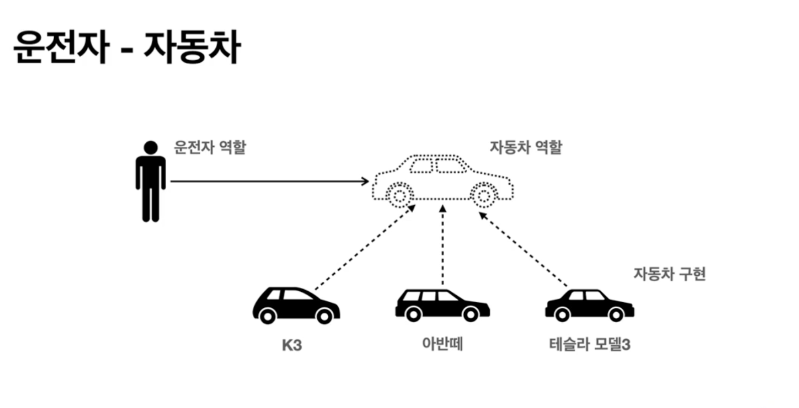

## 좋은 객체 지향 프로그래밍이란

---

https://www.youtube.com/watch?v=_a4EpxaA7h4&t=3s

### 객체 지향 프로그래밍이란

프로그램을 단순히 데이터와 처리 방법으로 나누는 것이 아니라, 프로그램을 수많은 '객체(object)'라는 기본 단위로 나누고 이들의 상호작용으로 서술하는 방식이다. 객체란 '메소드와 변수'를 가지며, 특정 역할을 수행하도록 인간이 정의한, 추상적인 개념이다

또한 유연하고 변경에 용이하기 때문에 대규모 소프트웨어 개발에 많이 사용된다.

### 객체지향의 특징

- 추상화
- 캡슐화
- 상속
- 다형성 (에시 - 운전자와 자동차, 공연 무대)

### 역할과 구현을 분리

- 역할과 구현으로 구분하면 단수하고 유연해지며 편리해지는것을 볼 수 있다.
- 클라이언트는..
  - 대상의 역할(인터페이스)만 알면 된다.
  - 구현 대상의 내부 구조를 몰라도 된다.
  - 구현 대상의 내부 구조가 변경되어도 영향을 받지 않는다.
  - 구현 대상 자체를 변경해도 영향을 받지 않는다.
- 역할 : 인터페이스
- 구현 : 인터페이스를 구현한 클래스, 구현 객체
- 역할과 구현을 명확히 분리하고, 역할을 먼저 부여한뒤 그 역할을 수행하는 구현 객체 만들기
- 유연하고 변경에 용이
- 확장 가능한 설계
- 클라이언트에 영향을 주지 않는 변경 가능
- 인터페이스를 안정적으로 잘 설계하는 것 중요

### 다형성의 본질

- 인터페이스를 구현한 객체 인스턴스를 실행 시점에 유연하게 변경할 수 있다.
- 클라이언트를 변경하지 않고, 서버의 구현 기능을 유연하게 변경할 수 있다.

- **운전자 - 자동차 예시**

운전자가 K3를 타다가 아반떼로 차를 바꾼다고 가정해보자, 그러면 운전을 못할까? 아니다. 운전자는 k3, 모닝, 아반떼 등의 차를 운전할 수 있다. 이는 자동차들은 자동차의 역할을 구현한것이기 때문이다. 또 운전자는 엑셀을 누르면 앞으로 가는것만 알면 된다. 엑셀을 밟으면 내연기관, 엔진 등이 어떻게 동작하는지 알필요가 없다는 것이다. 이는 클라이언트가 내부 구현이 어떻게 되어있는지 알 필요가 없다는 내용과 일치한다.

### 스프링과 객체지향

- 다형성이 가장 중요
- 스프링은 다형성을 극대화해서 개발할 수 있게 도와줌
- 제어의 역전(IoC), 의존관계 주입(DI)은 다형성을 활용해 역할과 구현을 편리하게 다룰 수 있도록 지원함.
- 레고 블럭 조립하듯이 구현 가능

### 그렇다면 좋은 객체 지향 설계를 어떻게 하면 좋을까?

[좋은 객체 지향 설계의 5가지 원칙](/%EC%8A%A4%ED%94%84%EB%A7%81%20%EA%B8%B0%EC%B4%88%20%EA%B0%9C%EB%85%90/%EC%A2%8B%EC%9D%80%20%EA%B0%9D%EC%B2%B4%20%EC%A7%80%ED%96%A5%20%EC%84%A4%EA%B3%84%EC%9D%98%205%EA%B0%80%EC%A7%80%20%EC%9B%90%EC%B9%99.md)
