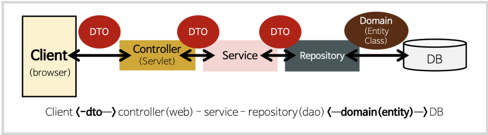

# ? DAO와 Repository

### DAO, Repository란

**DAO(Data Access Object)** : DB 데이터에 접근하기 위한 객체로 실제로 DB 데이터에 접근한다. 프로젝트 내 서비스 모델과 DB 데이터를 연결해주는 역할을 한다.

**DAO와 Repository** : 거의 같다고 생각해도 무방하지만, 자세히 보자면 repository는 엔티티 객체를 보관하고 관리하는 저장소이고, DAO는 데이터에 접근하도록 DB접근 관련 로직들을 모아둔 객체이다.

출처 : https://www.inflearn.com/questions/111159/domain%EA%B3%BC-repository-%EC%A7%88%EB%AC%B8
