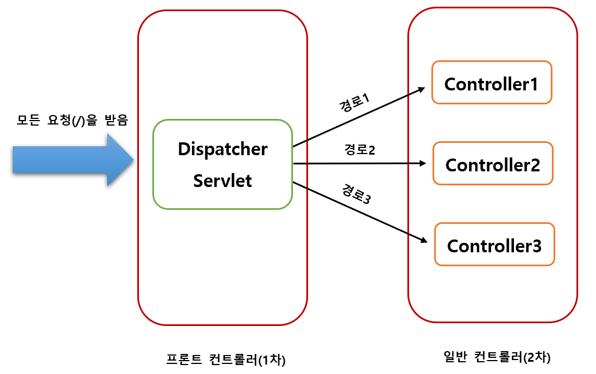
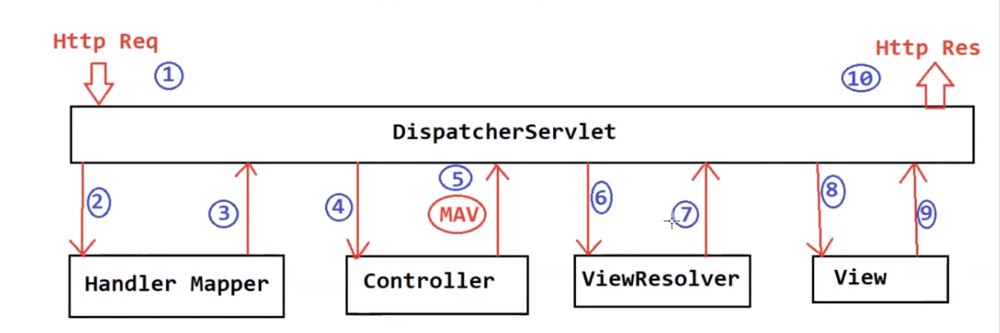

# Spring MVC의 구성요소

## 1. **DispatcherServlet**

- HTTP 프로토콜로 들어오는 모든 요청을 먼저 받아 적합한 컨트롤러에 위임해주는 프론트 컨트롤러입니다.

  - 프론트 컨트롤러란 서버로 들어오는 클라이언트의 모든 요청을 받아서 처리해주는 컨트롤러입니다.

  

      
    

## 2. **Handler Mapper**

- 클라이언트의 요청(URL)을 어떤 컨트롤러의 어떤 메소드가 처리할지 결정하는 역할을 합니다.
  - 요청된 URL을 실제 서버의 어떤 로직으로 연결할지 매핑하는 컴포넌트입니다.
- Handler Mapper는 요청을 받으면 해당 요청의 url을 분석하여 해당하는 컨트롤러와 그 안의 메소드를 찾아낸 후, DIspatcher Servlet에게 반환합니다.

## 3. **Controller**

- 클라이언트의 요청을 받아 처리하고, 그 결과를 다시 클라이언트에게 반환하는 컴포넌트입니다.
- 사용자 인터페이스와 애플리케이션 로직 사이의 중간자 역할을 합니다.
- 주요 역할

1. 요청 처리: 클라이언트로부터 들어오는 요청을 받아 해당 요청에 맞는 비즈니스 로직을 호출
2. 모델 조작: 컨트롤러는 비즈니스 로직을 통해 애플리케이션의 상태나 데이터(모델)를 조작하고, 처리 결과를 모델에 반영, 이 모델 데이터는 뷰에서 사용자에게 표시되는 정보를 구성하는 데 사용
3. 뷰 선택: 요청을 처리한 후에는 사용자에게 보여줄 뷰(View)를 선택

## 4. **ViewResolver**

- 컨트롤러가 처리한 결과를 바탕으로 적절한 뷰를 찾고 렌더링하는 역할을 합니다.
- 컨트롤러가 요청을 처리한 후, 모델 데이터와 함께 뷰의 이름을 반환합니다. 이때 ViewResolver가 해당 뷰 이름에 맞는 실제 뷰 템플릿 파일을 찾아서 반환하며, 이 파이 클라이언트에게 응답으로 전송합니다.

## 5. **View**

- Model을 이용하여 웹 브라우저와 같은 애플리케이션의 화면에 보이는 리소스(Resource)를 제공하는 역할을 합니다.

# 스프링 MVC 내부 작동 원리 | 스프링 MVC 요청 흐름

   

1. 클라이언트(브라우저)가 특정 URL로 HTTP 요청을 보냅니다.
2. DispatcherServlet이 요청을 받습니다.
3. HandlerMapper에 어떤 컨트롤러가 요청을 처리할 책임이 있는지 확인합니다.
4. 선택된 핸들러와 컨트롤러의 상세 정보를 반환합니다.
5. 컨트롤러는 요청을 처리하고 결과를 DispatcherServlet에 반환합니다.
6. DispatcherServlet은 ViewResolver에 상담합니다.
7. ViewResolver는 실제 뷰를 찾아 반환합니다.
8. DispatcherServlet은 뷰와 모델을 뷰 컴포넌트에 전송합니다.
9. 뷰 컴포넌트는 HTML 출력을 형성합니다.
10. DispatcherServlet은 최종적으로 HTML 출력을 브라우저에 렌더링을 위해 응답으로 전송합니다.

# Three Tier (Three Layer) Architecture

   

1. **Presentation layer**

   - 사용자에게 애플리케이션의 기능과 데이터를 제공하는 사용자 인터페이스입니다.

2. **Business Logic layer**

   - 애플리케이션의 핵심 기능을 구동하는 비즈니스 로직을 포함하고 있습니다.

3. **Data Access layer**
   - 데이터베이스와 상호작용하여 애플리케이션 데이터를 저장하고 복원합니다.

# MVC Pattern

1. **Model**

   - 시스템의 비즈니스 로직을 포함하는 데이터 계층입니다. 애플리케이션의 상태를 나타냅니다.

2. **Controller**

   - 컨트롤러 계층은 뷰와 모델 사이의 인터페이스로 작용합니다.

3. **View**
   - 컨트롤러에 의해 가져온 모델 데이터를 표시하는 데 사용됩니다.

   

# 스프링 MVC 웹 애플리케이션에서 3계층 아키텍처를 사용하는 방법

   

1. Controller Class를 Presentation layer로 사용
   - 이 계층은 가능한 한 얇게 유지하고 MVC 작업의 메커니즘에만 제한해야 합니다.
2. Service Class를 Business Logic layer로 사용
   - 컨트롤러 클래스에 의해 호출되며, 저장소나 다른 서비스를 호출할 수도 있습니다.
3. Repository Class를 Data Access layer로 사용
   - 데이터 소스에서 생성(Create), 검색(Retrieve), 업데이트(Update), 삭제(Delete) (CRUD) 작업으로 제한합니다.
