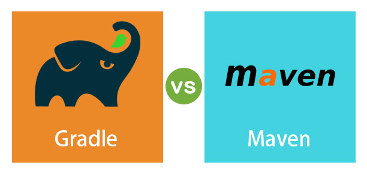

# ? Maven과 Gradle

## Java의 빌드 도구인 Maven과 Gradle에 대해서 알아보자

## **빌드 도구**

빌드 도구는 소프트웨어 개발 과정에서 코드 컴파일, 라이브러리 관리, 패키징, 테스트, 배포 등의 과정을 자동화하는 데 사용되는 도구이다. 주요 빌드 도구로는 Maven, Gradle, Ant 등이 있으며, 각 도구는 프로젝트의 종속성 관리, 빌드 스크립트 작성 방식, 성능 최적화 기능 등에서 차이를 보인다. Maven과 Gradle은 현재 가장 널리 사용 되고 있는 빌드 도구입니다.

## **Maven**

Maven은 Java 프로젝트의 빌드, 종속성 관리 및 프로젝트 정보 관리를 자동화하는 도구입니다.

Maven을 사용하는 예시로는 Java 프로젝트에서 pom.xml 파일을 설정하는 과정을 들 수 있습니다. 이 파일 내에서 프로젝트의 종속성, 빌드 과정, 플러그인 등을 정의합니다. 예를 들어, Spring Framework를 사용하는 프로젝트의 경우, pom.xml에 Spring 관련 종속성을 추가하여 Maven이 자동으로 필요한 라이브러리를 다운로드하고 관리하게 할 수 있습니다. Maven은 이러한 설정을 바탕으로 컴파일, 테스트, 패키지 생성 등의 작업을 자동으로 수행합니다.

## **Gradle**

Gradle은 오픈 소스 빌드 자동화 도구로, Groovy나 Kotlin을 기반으로 한 스크립트를 사용하여 프로젝트의 빌드 과정을 구성합니다.

Gradle 예시로는 build.gradle 파일을 통해 종속성을 선언하고 빌드 스크립트를 구성하는 과정을 들 수 있습니다. 예를 들어, Spring Boot 프로젝트에 필요한 Spring Boot 스타터 종속성을 추가하기 위해 dependencies 블록 내에 해당 종속성을 명시합니다. Gradle은 이 설정을 통해 필요한 라이브러리를 자동으로 다운로드하고 관리합니다. 또한, 사용자는 task를 정의하여 커스텀 빌드 로직을 구현할 수 있습니다.

## **Maven VS Gradle**

Gradle은 작업 의존성 그래프를 기반으로하는 반면 Maven은 고정적이고 선형적인 단계의 모델을 기반으로한다고 한다.

간단하게 이야기 하자면 Gradle이 Maven에 비해 빌드시간이 단축되고 커스터마이징이 간편하다.

Maven VS Gradle 출처(더 알아보기) : https://jisooo.tistory.com/entry/Spring-%EB%B9%8C%EB%93%9C-%EA%B4%80%EB%A6%AC-%EB%8F%84%EA%B5%AC-Maven%EA%B3%BC-Gradle-%EB%B9%84%EA%B5%90%ED%95%98%EA%B8%B0
