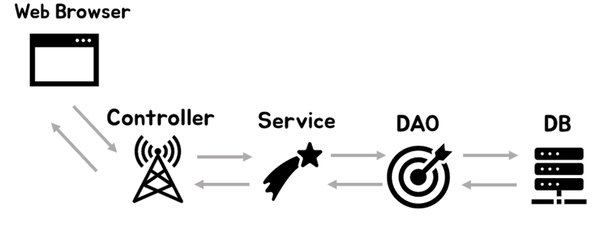

## 실습자료

---

   
 <b>SpringMVC-SignUpForm 실습</b>

- https://www.javaguides.net/2018/10/spring-mvc-sign-up-form-handling.html

: Spring MVC를 사용하여 간단한 회원가입 양식을 만들고 제출하는 방법을 안내합니다. Spring MVC 5+, Maven, JSP, Eclipse 또는 STS를 활용한 개발 과정을 단계별로 설명하며, Maven 프로젝트 설정, 의존성, 프로젝트 구조 및 Java 기반 주석을 사용한 설정 방법을 다룹니다. 양식 데이터 처리를 위한 @ModelAttribute 및 @RequestMapping 주석 사용, 양식 모델 클래스, 컨트롤러 클래스 구현 및 양식 제출 및 성공 페이지를 위한 JSP 뷰 구성 방법을 시연합니다.

    
<b>SpringMVC JSPFormTags 실습</b>

- https://www.javaguides.net/2018/10/spring-mvc-jsp-form-tags-tutorial.html

: 이 튜토리얼은 Spring MVC JSP 폼 태그를 광범위하게 다룹니다. Spring의 백엔드와 긴밀히 통합된 폼을 생성하는 데 필요한 폼, 텍스트 필드, 선택, 체크박스, 라디오 박스, 비밀번호, 버튼, 에러 태그 등을 포함한 폼 태그 사용법을 소개합니다. 각 폼 태그를 사용하는 방법에 대한 예시와 자세한 설명을 제공합니다.

    
<b>Spring MVC Form Validation using Annotations - Hibernate Validator 실습</b>

- https://www.javaguides.net/2018/10/spring-mvc-form-validation-with-annotations-tutorial.html

: 이 튜토리얼에서는 Java bean 검증 어노테이션을 사용하여 Spring MVC 웹 애플리케이션에서 폼 검증을 수행하는 방법을 배웁니다. Spring MVC 라이브러리를 사용하며, 필수 필드 확인, 주어진 범위 내의 숫자 검증, 우편번호 형식 검증, 사용자 정의 비즈니스 규칙 추가 등을 포함한 다양한 유효성 검사를 다룹니다. Hibernate validator 라이브러리를 사용하여 Java의 표준 Bean 검증 API를 구현합니다.

    
<b>Spring MVC + Hibernate + JSP + MySQL CRUD 실습</b>

- https://www.javaguides.net/2018/11/spring-mvc-5-hibernate-5-jsp-mysql-crud-tutorial.html

: 이 튜토리얼은 Spring MVC 5, Hibernate 5, JSP, 그리고 MySQL을 사용하여 CRUD(생성, 읽기, 업데이트, 삭제) 애플리케이션을 만드는 과정을 안내합니다. Maven을 기반으로 한 웹 애플리케이션 생성, 필요한 의존성 추가, 프로젝트 구조 설정, DispatcherServlet 구성, Spring과 Hibernate 통합 설정, 엔티티 및 컨트롤러 구현, 서비스 및 DAO 레이어 작업, 뷰 레이어 생성까지의 단계별 접근 방식을 설명합니다. 웹 애플리케이션 개발에 있어서 실제 데이터베이스와의 상호 작용을 포함한 전체적인 백엔드 구성 방법을 제시합니다​

    
<b>Spring MVC 5 + Spring Data JPA + Hibernate 5 + JSP + MySQL 실습 </b>

- https://www.javaguides.net/2018/11/spring-mvc-5-hibernate-5-jsp-mysql-crud-tutorial.html

: Spring MVC, Hibernate, JSP, MySQL을 사용하여 CRUD(생성, 읽기, 업데이트, 삭제) 애플리케이션을 만드는 과정을 안내합니다. 기본적인 Java 지식, Spring MVC, Hibernate, JSP에 대한 이해, 그리고 MySQL이 설치된 환경이 필요합니다. Maven 웹 애플리케이션을 만들고, 필요한 Maven 의존성을 추가한 다음, 프로젝트 구조를 설정합니다. Spring의 DispatcherServlet을 구성하고, Hibernate와의 통합을 설정합니다. 또한, Java 기반의 Spring 구성을 사용하여 Spring MVC 빈 구성을 정의하고, JPA 엔티티를 생성합니다. 컨트롤러, 서비스 레이어, DAO 레이어를 구현하고, 최종적으로 JSP를 사용하여 뷰 레이어를 만듭니다.

